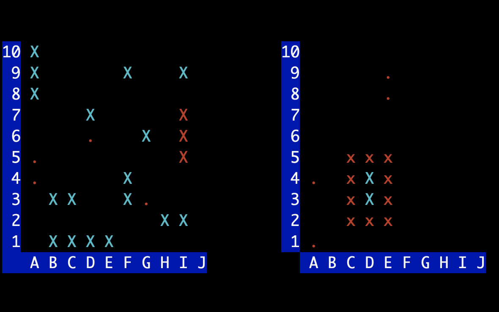

# Warships-LightGUI is a lightweight GUI to the training game 'Warships Online', created for the Akademia Programowania PJATK



You can easily create an ascii-based GUI for the 'Warships Online' game. This is a very simple solution, suggested for beginners. If you want to create a more sophisticated GUI, please use: 
- http://github.com/grupawp/warships-gui


## Quick Start

To initialize the *board* use the **New()** method. **NewConfig()** will load the default layout.

```go
board := gui.New(
    gui.NewConfig()
)

board.Display()
```

It's possible to customize layout of the board. Use the **ConfigParams()** method and just after it put any parameters as in the example below. 

**NewConfig()** at the end of sequence, generates a new configuration that you can use as a parameter to **New()**


```go
board := gui.New(
    gui.ConfigParams().
        HitChar('#').
        HitColor(color.FgRed).
        BorderColor(color.BgRed).
        RulerTextColor(color.BgYellow).
        NewConfig()
)

board.Display()
```


## Available Options

### Marking a ship component as hit
- HitColor(color)
- HitChar(byte)

### Missed shot
- MissColor(color)
- MissChar(byte)

### Ship component
- ShipColor(color)
- ShipChar(byte)

### Border around the sunken ship
- BorderColor(color)
- BorderChar(byte)

### Empty element on the board
- EmptyColor(color)
- EmptyChar(byte)

### Horizontal and vertical ruler text color
- RulerTextColor(color)

## Methods and constants

- **pos** type is defined as below. 

```go
const (
	Left
	Right
)
```

    - 'Left' means the board on the left side of the screen, e.g. a board with your own ships.
    - 'Right' means the board on the other side (your opponent's ships)


- **state** type definition:
```go
const (
	Empty
	Hit
	Miss
	Ship
	Border
)
```

### After create a *board* object, you can use the following methods:

```go
func (board) HitOrMiss(p pos, coord string) state
```

- **HitOrMiss()** checks if a state at the coord is a Ship, then change to Hit and return Hit. Else (not a Ship), change to Miss and return Miss

```go
func (board) Set(p pos, coord string, s state)
```

- **Set()** changes the state at the selected coordinates 
    - p: Left or Right board
    - coord: "A7", "C3" etc.
    - s: Hit, Ship etc.

```go
func (board) Export(p pos) []string 
```

- **Export()** exports the board configuration to a format accepted by the game server
    - p: Left or Right board

```go
func (board) Import(coords []string) 
```

- **Import()** imports the board from array of coord
    - coords: []string{"A4", "C1"} etc.

```go
func (board) Display()
```

- **Display()** displays both boards (left and right)


